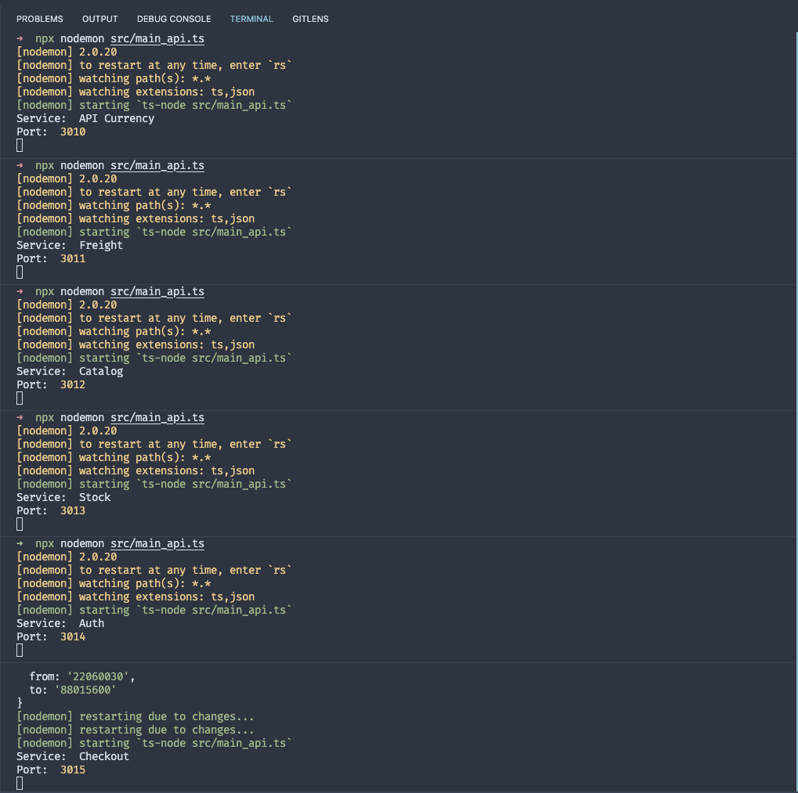
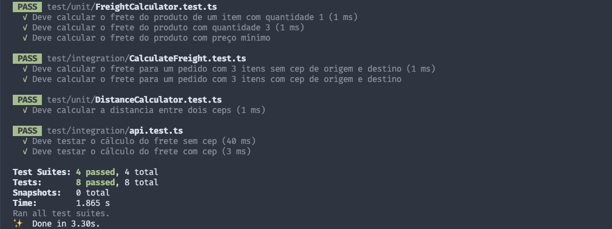
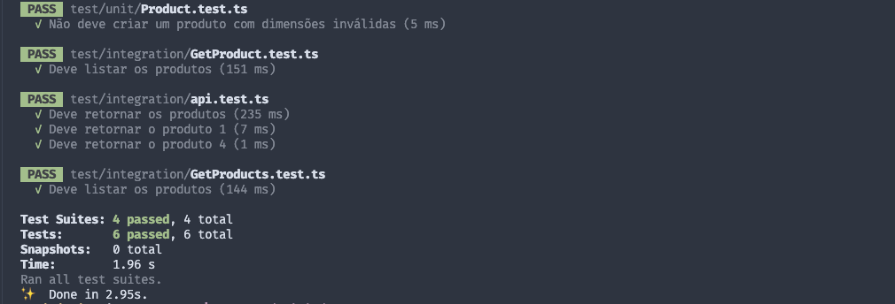
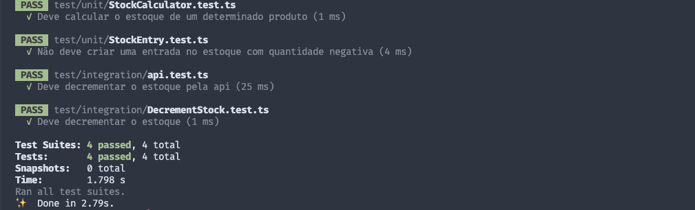
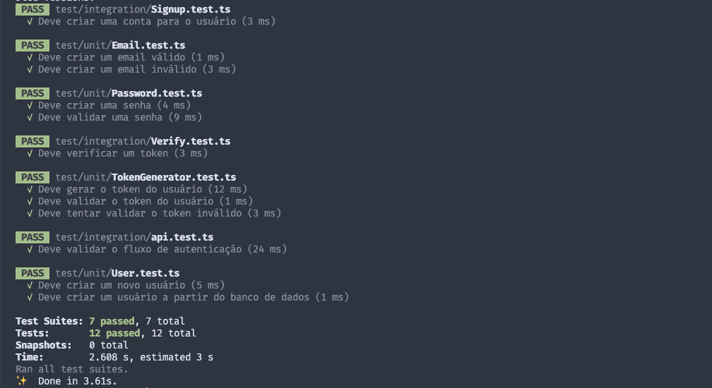
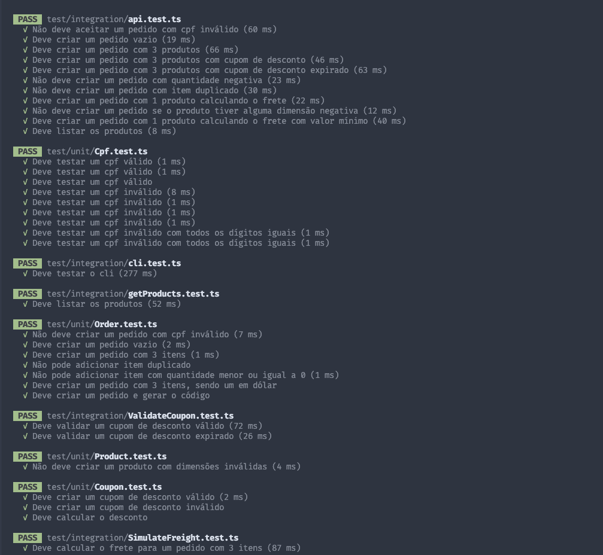
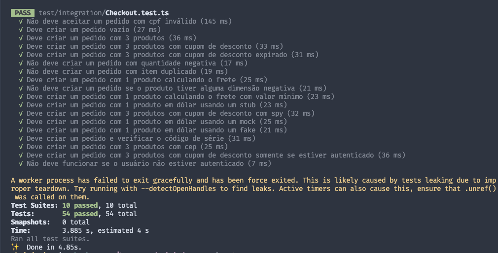
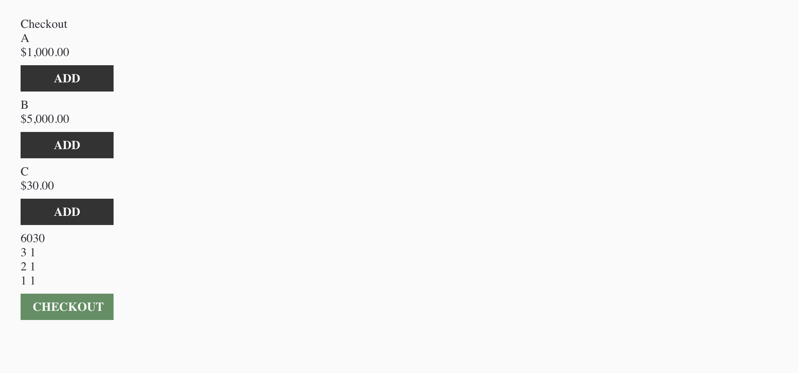

### Curso de Clean Code e Clean Architecture - Rodrigo Branas

Curso do Rodrigo Branas sobre Microservices com TypeScript e Clean Code, Refactoring, TDD, OO, Ports and Adapters, Clean Architecture, Domain-Driven Design, Design Patterns, SOLID, Event-Driven Architecture e CQRS.

    
    

---

#### Descrição

Curso do Rodrigo Branas sobre Microservices com TypeScript e Clean Code, Refactoring, TDD, OO, Ports and Adapters, Clean Architecture, Domain-Driven Design, Design Patterns, SOLID, Event-Driven Architecture e CQRS.

---

#### Visualizar o projeto na IDE:

Para quem quiser visualizar o projeto na IDE clique no teclado a tecla `ponto`, esse recurso do GitHub é bem bacana

#### Aulas 01
Refactoring tem mais relação com a alteração feita na estrutura interna do software, para torná-lo mais fácil o entedimento e menos custoso se ser modificado.

Onde não é alterado o seu comportamento, mas sim o investimento para entregar o mesmo resultado de antes, melhor estruturado.

Para ter a segurança de refatorar um código, por onde começar?

- Tests Unitários;
    - Nosso teste simplesmente é um cliente para nosso código;
    - Para iniciar nossos testes aplicamos essas regras:
        - Given / Arrange
        - When / Act
        - Then / Assert
- Identificar Code Smells;
    - Nomes estranhos;
        - Renomear Funções;
        - Renomear Variáveis;
        - Renomear Arquivos;
    - Reduzir o tamanho vertical do código;
        - Remover Linhas em branco métodos e funções;
            - Linha em branco divide membros de classe, métodos, construtores, variáveis de instância, etc;
        - Remover Cometários;
            - Nomes de variáveis / funções explicativas;
            - Manter apenas quando necessário;
    - Remover código morto;
    - Muitas condições confusas, aninhadas, complexas, extensas;
        - Introduzir cláusula guarda;
        - Remover else;
        - Extrair condições;
        - Consolidar condições;
        - Inverter Condição;
        - Introduzir ternário;
    - Números mágicos;
        - Extrair constantes / váviaveis;
    - Tratamento inadequada de erros;
        Tratar erros de forma adequada;
    - Classe / Arquivo grande;
        - Extrair Classe;
#### Aulas 02
- Inveja de dados (longa cadeia de mensagens - Facade abstrai um subsistema mais complexo)
    - Extrair um método;
    - Mover um método para outra classe

#### Testes
Testes automatizados são a única forma que temos de garantir que o código funciona.

Entender o porque se teve tempo de contratar uma equie de QA, criar uma rotina de testes, criar um documento com fluxo de testes, porque não foi criado testes automatizados?

Testes manuais são importantes e sempre vão existir, mas sempre devem ser complementares.

O que é um teste automatizado?
- Dado um conjunto de entradas, quando algo acontecer a saída deve suprir as expectativas.
    - Given / Arrange: Definição de todas as informações necessárias para executar o comportamento que será testado;
    - When / Act: Executar o comportamento;
    - Then / Assert: Verificar o que aconteceu após a execução, comparando as informações retornadas com a expectativa que foi criada;

Alguns tipos de testes:
- E2E: Já são mais lentos e mais frágeis, pois se baseam em interfaces finais e interfaces sempre estão mudando.
- Integration: Testam recursos externos, são mais lentos e requer mais exforço de programação e já utilizam mais Tests Patterns como mocks, stubs e spyes.
- Unit: Testam comportamentos mais isolados, não lidam com recursos externos, não necessitam muito Tests Patterns como mocks, stubs e spyes.

Unit Tests: São testes de unidade, não becessáriamente unitários, que podem ou não envolver vários componentes pertencentes à mesma camanda e sem qualquer interação com recursos externos como um banco de dados, uma API ou sistema de arquivos.

Integration Tests: Testam componentes pertencentes à múltiplas camadas e normalmente envolvem recursos externos, sejam eles reais ou não, ou seja, o fato de utilizar um Test Pattern como Stub ou Mock não torna o teste de unidade.

E2E Tests: Replicam o ambiente do usuário final, ou seja, são testes executados de ponta a ponta.

FIRST:
- Fast: Os testes devem rodar rápido, assim podemos rodar mais vezes os testes.
- Independente: Não deve existir dependência entre os testes, eles devem poder ser executados de forma isolada.
- Repeatable: O resultado deve ser o mesmo indepentente da quantidade de vezes que seja executado.
- Self-validating: O próprio teste deve ter uma saída bem definida que é válida ou não fazendo que ele passe ou falhe, sempre o assert tem de confirmar todos cenários.
- Timely: Os testes devem ser escritos antes do código em produção.

TDD é um metodo para construir softwares e não para testá-lo que segue o fluxo:
- RED: Escreve um teste que falhe.
- GREEN: Escreve o código que faça o teste passar.
- Refactor: Refatorar o código escrito.

Como começar a testar, dê o primeiro passo, criar um exemplo que as pessoas possam usar como base, com isso passe pelos 5%, 15%, 25%, ... de coverage.

Foque no que tem mais risco e com o que muda com mais frequeência, automatize o que da mais retorno.

#### Aulas 03
Ports and Adapters - Arquitetura Hexagonal

Tornar a aplicação independente de quem guia a aplicação e de seus recursos.

Dividir a aplicação em :
- Drivers: Test Cases, Usuários, APIs, interface gráfica, CLI ou qualquer coisa que seja um Driver, algo que guia sua aplicação.
- Resources: database, SMTP server, File System entre outros.

Porque o nome é Hexagonal: simplemente um recurso visual para poder ter espaços para desenhar os diagramas.

Porque Porta?

A analogia com uma porta é exatamente a mesma que temos em quando pensamos em conectar qualquer tipo de dispositivo em um computador, existe um contrato com um protocolo definido onde qualquer fornecedor pode adaptar sua tecnologia para interagir com a porta.

Porque Adapters?

São simplesmente as implementações dos casos de usos dessa portas.

Faz sentido aplicar Ports and Adpters em qualquer contexto?

Sim, podemos aplicar em todos contextos, pois sempre consumimos recursos e somos guiados por mais de um Driver, como por exemplo Testes, APIs, etc.

No caso do recurso não é necessário ter mais de um, basta um pos queremos ter o controle desse recurso.

Tests Patterns

Um test double é um padrão que tem o objetivo de substituir um DOC (depended-on component) em um determinado tipo de teste por motivos de performance ou segurança.

- Dummy: Objetos que criamos apenas para completar a lista de parâmetros que precisamos passar para invocar um determinado método.
- Stubs: Objetos que retornam respostas prontas, definidas para um determinado teste, por questão de performance ou segurança (exemplo: quando eu executar o método fazer o pedido preciso que o método pegue a cotação do dolar retornando R$ 3,00).
- Spies: Objetos que espionam a execução e armazenam os resultados para a verificação posterior (exemplo: quando eu executar o método fazer pedido preciso saber se o método enviar email foi invocado internamente e com quais parâmetros).
- Mocks: Objetos similares a Stubs e Spies, permitem que você diga exatamente o que quer que ele faça, nós podemos programar o que será feito.
- Fake: Objetos que tem implementações que simulam o funcionamento da instância real, que seria utilizada em produção (exemplo: uma base de dados em memória).

#### Aulas 04
Talvez o nome Clean Design faça mais sentido que Clean Architecture.

Pois o Design está muito mais relacionado a responsabilidades e distribuição de responsabilidades.

Enquanto a Arquitetura traz mais conceitos sobre restrições que você impõe no projeto, exemplo, definição da linguagem de programação, paradigmas adotado, tipo de comunicação entre serviços, frameworks, etc...

Tudo isso são restições impostas que afetam o Design.

Douglas Martin: Design is inevitable, the alternative to good design is bad design, not no design at all.

O que considerar na hora de definir o Design e a Arquitetura de um Software?

- Escodo do produto; - Cada escopo tem suas especificidades;
- Quem é, e qual é o tamamnho da equipe; - O tamanho da equipe e a experiência define diretamente o direcionamento que irá seguir;
- Prazo de entrega; - Usa o que o time sabe, a ferramenta que tem o domínio;
- Tipo de dispositio;
- Volume de requisições;
- Orçamento;

Não se deve adotar o mesmo tipo de abordagem para tudo, mas é uma boa prática definir padrões e seguir.

Não existe um tipo de resposta que atenda sempre.

Nas últimas décadas, vários modelos infuenciaram o Design e a Arquitetura.

Um deles Ivar Jacobson (1992) BCE, EBI, EIC, ECB (Entity-control-boudary) é um padrão arquitetural usando um use-case dirigido a orientação a objeto no design de software.

- Entity representa uma informação relevante para os Stakeholders, usualmente persistente.
- Bondary é uma espécie de interface para quem está fora poder consumir.
- Control garante o preocessamento da execução do seu use-case, e sua regra de negócio coordenando a sequencia de objetos envolvidos.

Uma grande similaridade do Clean Architecture.

Ivar Jacbson: Iniciantes podem muitas vezes utlizar  Entities Objects como transportadores de dados e colocar as regras de negócio em si dentro do Control Object. Isso deve ser evitado. Muitos comportamentos deveriam e poderiam ser colocados nos objetos de entidades que são idependentes.

- Domain-Driven Design, Eric Evnas 2003
- Hexagonal Archtiecture ou Ports and Adapters, Alistair Cockburn 2005
- Onion Architecture, Jeff Palermo 2008

Todas elas tem coisas em comum:
- Isolam as regras de negócio;
- Definem camadas e suas responsabilidades;
- Criam um fluxo de controle e dependência ordenado e direcional;
- Favorecem a testabilidade;
- São independentes de recursos externos;
- Favorecem a evolução tecnológica;

Clean Architecture, Robert Martin 2012

É um modelo que tem como objetivo o desacoplamento entre as regras de ngócio, ou domínio da aplicação e os seus recursos externos como frameworks e banco de dados.

Entities - Entripise (Independence) Business Rules

Entidades são responsáveis por modelar as regras de negócio independentes, aplicadas em qualquer contexto e que podem ser desde um objeto com métodos até mesmo um conjunto de funções.

Como e onde usar?

Nos Use Cases - Application Business Rules

Na Clean Architecture, os casos de uso contém a aplicação das regras de ngócio idependente em um contexto específico.

Eles realizam a orquestração das entidades, executando regras de negócio independentes.

Geralmente é um verbo:
- Fazer um pedido;
- Cancelar um pedido;
- Simular o frete;
- Validar um cupom de desconto;
- Realizar um pagamento;
- Emitir uma nota fiscal.

Repare que os nomes dos casos de uso tem relação com a Screaming Architecture, dar o nome da Classe ou Arquivo ao Use-case.

Interface Adapters

Os Interfaces Adapters fazem a ponte entre os casos de uso e os recursos externos.

São responsáveis por realizar a conversão de dados de uma tecnologia.

Frameworks & Drivers

Por fim os frameworks and drivers são o nível mais baixo de abstração, é o componente que realiza a conexão com o banco de dados, requisições HTTP, interage com o sistema de arquivos ou acessa recursos do SO.

O fuxo de dependência é de fora para dentro.

#### Aulas 05
Apenas código sem teoria.

#### Aulas 06

DDD - Domain-Driven Design

É sobre colocar a comunicação e o domínio em primeiro lugar na hora de desenvolver um software.

Com o tempo, principalmente em um domínio complexo, existe o risco de ficar embarassadas, e não definidas.

Pois são muitas pessoas envolvidas, muitas áreas de negócios diferentes.

Normalmente acontece um fenômeno conhecido como Big Ball of Mud.

O domínio é o problema que um organização precisa resolver para entregar uma solução que realmente atenda as necessidades de negócio dos seus clientes.

Nem sempre é fácil extrair o conhecimento relacionado ao domínio.

Uma das principais habilidades de alguém que desenvolve software é saber fazer perguntas.

A linguagem ubiqua é falada entre especialistas no domínio e a equipe de desenvolvimento dentro de um determinado contexto delimitado, que é o local onde aquele domínio se aplica.

Além disso, a linguagem ubiqua deve ser refletida dentro do código-fonte, não apenas em documentos e diagramas.

Modelagem Estratégica identifica e define as fronteiras entre os Bounded Contexts.

Um Bounded Context é onde o problema é resolvido, está no espaço da solução, forma um limite explícito dentro do qual um modelo de domínio será implementado.

Tipos de subdomínio:
- Core ou Basic: É o mais importante e que traz mais valor para a empresa, é onde você coloca seus maiores e melhores esforços.
- Support ou Auxiliary: Complementa o core domain, sem ele não é possível ter sucesso no negócio.
- Generic: É um subdomínio que pode ser delegado para outra empresa ou mesmo ser um produto de mercado.

A forma de interação entre cada Bounded Context é detalhada em um Context Map.

Os padrões de integração definem o tipo de relacionamento entre cada Bounded Context.

Shared Kernel:

Existem contextos delimitados diferentes desenvolvidos em parceria, ou até mesmo dentro da mesma equipe, pode gerar acoplamento e exige um esforço de gestão em conjunto.

Normalmente precisam ser importados como um biblioteca e é importante que ela seja publicada e versionada, caso contrário a relação pode ser frágil.

Customer / Supplier:

Aqui existe uma relação de fornecimento, no entando, tudo é combinado e adequado às necessidades em uma relação entre o upstream, fornecedor, e o downstream, consumidor.

Conformist / Open Host Service / Published Language:

Uma integração com uma API externa, contratada no modelo SaaS, acaba sendo do tipo conformista já que temos que nos adequar a sua interface, nesses casos é normal oferecer um Open Host Service com uma Published Language.

Anti-Corruption Layer:

As relações conformistas geralmente exigem uma tradução para o domínio e isso pode ser feito pode meio de adaptadores importantes para inclusive permitir a utilização de diferentes fornecedores.

Separate Ways:

São decisões de seguir por caminhos independentes e sem integração.

Nem todo Bounded Context precisa ser desenvolvido da mesma forma.

A fronteira do Bounded Context é excelente para definir um microserviço.

Analizar o Domínio -> Definir o Bounded Context -> Identificar o Microserviço.

Quais são as vantagens e desvantagens em ter uma arquitetura de microserviços?

Vantagens:
- Diversidade tecnológica;
- Melhor controle sobre o débito técnico;
- Facilidade em acompanhar a evolução tecnológica;

Desafios:
- Transações distribuídas;
- Dificuldade em tratar e diagnosticar erros;
- Complexidade técnica mais alta;

Fazendo uma Boa Modelagem estratégica:
- Divisão de complexidade;
- Equipes menores;
- Reuso;

Comunicação assíncrona, Event-Driven Architecture, CQRS.
- Escalabilidade;
- Independência entre os serciços;
- Tolerância à falhas;
- Resiliência;

Uma arquitetura monolítica nem sempre é ruim, muito pelo contrário.

Para projetos menores com equipes pequenas, principalmente no início da contrsução de um produto, é a arquitetura que dá mais resultado com o menor esforço e custo de infraestrutura.

Modelagem Tática

É utilizada dentro do Bounded Context para construir o domain model por meio de objetos de domínio.

Nem sempre faz sentido adotar o Domain-Driven Design no nível tático, depende do negócio.

Quando evitar Domain-Driven Design no nível tático
- Exportação de dados;
- ETLs (Extract, Transform, Load);
- CRUDs;
- Relatórios;
- Integrações.

Geralmente nesses tipos de projetos não existe um domínio estabelecido.

Resumindo, quando não envolver a implementação de regras de negócio.

Outro ponto de atenção é com a equipe, desenvolver orientado ao domínio requer mais experiência e esforço na modelagem.

Objetos de Domínio:
- Entities;
- Value Objects;
- Domain Services;
- Aggregates;
- Repositories.

Entities

Abstraem regras de negócio independentes, assim como no Clean Architecture, mas no DDD elas tem identidade e estado, podendo sofrer mutação ao longo do tempo.

Exemplos:
- Pedido: Pode ter mais ou menos itens, com o tempo é pago, entregue ou até mesmo cancelado;
- Produto: Muda de preço com frequência e pode ser descontinuado;
- Cliente: Eventualmente muda de endereço e telefone ou cancela a sua conta;
- Cupom: Pode ter a sua validade alterada, eventualmente ser restrito a uma categoria de itens ou até mesmo ter uma determinada quantidade disponível para utilização.

Como gerar identidade?
- Manualmente: O próprio usuário pode gerar a identidade da entidade, nesse caso é mais complicado garantir a unicidade;
- Aplicação: A aplicação pode utilizar um algoritmo para gerar a identidade como um gerador de UUID e GUID;
- Banco de dados: O banco de dados por meio de uma sequence ou outro tipo de registro pode centralizar a geração da identidade;
- Outro bounded context: A geração pode ser delegada para outro bounded context.

Como comparar?

A comparação entre entities se dá normalmente pela identidade, sem levar em consideração as características do objeto.

Value Objects

Também contém regras de negócio independente, no entato são identificados pelo seu valor, sendo imutáveis, ou seja, a sua mudança implica na sua substituição.

Características
- Mede, quantifica ou descreve uma coisa no domínio;
- Seu valor é imutável;
- É substituido quando seu valor mudar;
- Pode ser comparado pelo valor que representa.

Exemplos:
- Código do pedido: Representa uma determinada regra de formação de número;
- CPF: Garante que o número do documento é válido;
- Dimensão: Abstrai a largura, altura, profundidade e peso de um item.

Substituir por um inteiro

Uma técnica para identificar uma Value Object é tentar substituílo por um tipo primitivo como uma string ou um número.

Um Value Object é restrito a uma Entity ou pode ser utilizado em vários lugares?

Domain Service

Realiza tarefas específicas do domínio, não tendo estado. É indicado quando a operação que você quer executar não pertence a uma Entity ou a um Value Object.

Exemplos
- Calculadora de frete: É responsável por analisar os itens de um pedido e determinar quanto deve ser pago.
- Calculadora de distância: Pegando duas  coordenadas retorna a distãncia.
- Calculadora de estoque: Com base em várias entradas e saídas do estoque, calcula quantos itens estão disponíveis.

Utilize em operações que envolvam múltiplos objetos de domínio.

Normalmente quando uma operação afeta múltiplos objetos de domínio, não pertence a nenhum deles, ela deve ser descrita em um domain service.

Cuidado para não criar serviços procedurais, favorecendo um modelo anêmico.

Como definir o relacionamento entre diferentes entities e value objects?

A relação entre os objetos de domínio não é a mesma utilizada no banco de dados.

Qual é o problema dessa abordagem?

Grandes aggregates podem trazer desperdício de memória, além de sobrecarregar o banco de dados sem necessidade já que nem sempre a camada de aplicação estará interessada em utilizá-lo na íntegra.

O desafio é balancear a preservação da inavariância com o comsumo de recursos.

Aggregates

Um aggregate é um agrupamento, ou cluster, de objetos de domínio como entities e values objects, estabelecendo o relacionamentos entre eles, tratado como uma unidade.

Todo aggregate tem uma raíz, que é uma entity por meio da qual as operações sobre o aggregate são realizadas.

Qual a solução? Quebrar em agregados.

Boas práticas na criação de aggregates

- Crie aggregates pequenos: Comece sempre com apenas uma entidade e cresça de acordo com as necessidades.
- Referencie outros aggregates por identidade: Mantenha apenas a referência para outros aggregates, isso reduz a quantidade de memória e o esforço que o repositório faz para recuperá-los.

Se estiver difícil de implementar o repositório, talvez o aggregate seja muito grande e possa ser separado.

Um aggregate deve refletir a base de dados? Não.

Isso faria o aggregate ser muito grande e consumir muita memória, tornando o repository mais complexo do que deveria.

Um aggregate pode referenciar outros aggregates? Pode mas por identidade.

Um aggregate pode ter apenas uma entity? Pode e quanto menor melhor. Mas cuidado, se tiver todo aggregate tem apenas um entity e um repository, temos um sistema anêmico.

Uma entity que faz parte de um aggregate pode fazer parte de outro? Não faz muito sentido, talves afete o SRP e frente a umas mudança poderia quebrar um dos aggregates que faz parte.

Repositories

É uma extensão do domínio responsável por realizar a persistência dos aggregates, separando o domínio da infraestrutura.

Qual a diferença do padrão Repository no Domain-Driven Design e o DAO?

Um Repository lida a persitência de um aggregate inteiro, enquanto um DAO não tem uma granularidade definida.

Somente parte do aggregate mudou, posso persistir apenas essa parte?

A persistência é sempre realizada sobre o aggregate inteiro, no entanto a implementação do repository pode decidir quais registros o banco de dados devem ser atualizados.

Posso obter apenas parte do aggregate? Isso significa que pode ser que o aggregate seja grande de mais e poderia ser quebrado em aggregates menores.

Posso utilizar lazy loading dentro do aggregate? A preservação da invariância depende da integridade do aggregate, se parte dele não estiver populado pode perder o sentido.

É possível utilizar diferentes filtros para obter um aggregate? Com certeza, na obtenção do aggregate diversos filtros podem ser utilizados.

Posso gerar dados para a emissão de um relatório a partir de uma repository? A granularidade de um relatório é diferente da utilizada pelo aggregate e renderizar relatórios a perti de repositories pode ser excessivamente complexo, prefira a utilização de CQRS com a criação de consultas separadas.

Application Service

É a API do Bounded Context, expondo operações de negócio relevantes para os clientes da aplicação, muito similar ao Use Case do Clean Architecture.

Atua como uma fachada para os clientes, que podem ser uma API Rest, GraphQL ou gRPC, uma interface gráfica, um CLI, uma fila entre outros.

Faz a orquestração dos objetos de domínio e interage com a infraestrutura para fins de persistência, comunicação, integração, segurança entre outros.

Mapeia DTOs para objetos de domínio e vice-versa, eventualmente utilizando recursos, como presenters para converter a saída para o formato mais adequado.

Não devem existir regras de negócio dentro do Application Service, apenas orquestração.

A camada de aplicação é naturalmente procedural enquanto a camada de domínio é favorecida pela orientação a objetos.

Um Application Service pode chamar outro? Pode, mas isso vai criando uma depeência que quebra o SRP, tornando o código frágil, talvez o ideal seja publicar eventos de domínio.

Somente o Application Service pode utilizar um repository diretamente? Quem é responsável por orquestrar os aggregates é o Application Service, por esse motivo o repository deve ser injetado nele e não nos aggregates.

Podem existir várias operações em um Application Service? Sim, sem problemas, isso não afeta o design, utilizar uma Screaming Architecture, conforme descrito pelo Robert Martin em Clean Architecture não é uma obrigação.

Um Application Service pode persistir vários aggregates na mesma operação? A consistência eventual pode trazer complexidade para o Appplication Service, nesse caso talvez uma abordagem orientada a eventos ou padrões como o Unit of Work possam ser utilizados.

Qual é a diferença entre um Use Case e um Application Service? Muda apenas a enfase.

Infrastruture Service

Os detalhes de implementação de cada tecnologia ficam restritos aos serviços de infraestrutura, que ficam numa camada independente da aplicação.

Modules

Fornecem uma separação física para um conjunto de objetos de domínio, geralmente separado por bounded context, facilitando a organização em projetos grandes.

Posso ter um monolito com múltiplos bounded contexts? Nem sempre você precisa de microserviços para separar os bounded contexts.

#### Aulas 07

No final dos anos 80, Bob Martin reuniu cerca de 9 princípios em um artigo, que na verdade foi uma resposta a outro artigo sobre orientação a objetos, que acabou servindo de base para os SOLID Principles.

SOLID é a reunião de 5 princípios de desenvolvimento de software orientado a objetos que são a base para criar um design cacpas de tolerar mudanças ao longo do tempo, ser fácil de enteder e reusar.

Básicamente ele indereça três coisas:

- Rigidity: É difícil de mudar porque cada alteração afeta outras partes da aplicação, forçando outras alterações, causa longos builds, tempo de execução de testes e sensibilidade à mudança.
- Fradility: Quando você faz uma mudança, quebra outras partes da aplicação, ou seja, existe um alto acoplamento, causa flahas inesperadas e difíceis de detectar.
- Immobility: É difífil de reusar porque o código-fonte está emaranhando, dentro de outros lugares, deixando o sistema difífil de modularizar.
#### SOLID Principles
- Single Responsibility
- Open/Closed
- Liskov Substitution
- Interface Segregation
- Dependency Inversion

Single Responsibility

Devemos separar as coisas que mudam por motivos diferentes e nesse contexto a palavra responsabilidade significa motivo para mudar.

Open/Closed

Os componentes da arquitetura devem estar abertos para extenção e fechados para modificação.

Fechado para mudança não siginifica que o código-fonte não pode mudar se for necessário.

A maior parte dos Design Patterns como Abstract Factory, Builder, Proxy, Chain of Responsability, Iterator, State, Strategy e Template Method respeita o Open/Closed Principle por ser polimórfico.

#### Aulas 08

Liskov Substitution

Se S (beer, whisky e water) é subclasse de T (item) então objetos do tipo T (item) podem ser substituídos por objetos do tipo S (beer, whisky e water) sem quebrar o funcionamento do programa.

Apenas definir uma subclasse não implica manter a coerência e preservar a invariância.

A proposta da Barbara Liskov foi justamente garantir que as subclasses possam ser intercambiadas sem causar problemas durante a execução do programa.

Pré-condições não devem ser fortalecidas.

As operações definidas na subclasse devem aceitar no mínimo as mesmas entradas da superclasse, ou mais.

Exemplo: Se a interface permite um parâmetro que é um número inteiro, caso uma instância limite a número negativos ela estará fortalecendo as pré-considções, causando possíveis incompatibilidades.

Pós-condições não devem ser enfraquecidas.

As operações definidas na subclasse devem produzir no mínimo o mesmo tipo de retorno da superclasse, ou algum que seja mais específico.

Exemplo: Se a superclasse limita o retorno aos números positivos a subclasse não deve enfraquecer a regra e permitir qualquer número, positivo e nagativo, mas ela pode retornar os positivos até 10.

A invariância deve ser preservada na subclasse.

Tudo que é assumido como verdade na superclasse deve seguir sendo verdade na subclasse.

Exemplo: Se na superclasse Pessoa a idade não pode ser negativa, uma subclasse deve seguir essa regra.

Interface Segregation

Uma subclasse não deveria implementar métodos que ela não usa, decomponha interfaces muito abrangentes em outras interfaces específicas.

Este princípio lida com as desvantagens de utilizar interfaces muito grandes, que podem acabar perdendo a coesão.

Evite interfaces muito grandes e extensas, prefira segmetá-las de acordo com as necessidades das subclasses.

Dependency Inversion

É a base do desacoplamento permitindo intercambiar depedências de acordo com a necessidade, facilitando os testes e a evolução com o passar do tempo.

Event-Driven Architecture

Uma arquitetura monolítica nem sempre é ruim, muito pelo contrário!

Para projetos menores com equipes pequenas, principalmente no início da construção de um produto, é a arquitetura que dá mais resultado com o menor esforço e custo de infra estrutura.

Muitas vezes somos levados a acreditar que microserviços são sempre perfeitos.

Cuidado, somente separar os serviços está londe de ser o único objetivo.

A pior coisa que podemos ter é uma arquitetura monolítica distribuída.
- Alto acoplamento entre serviços.
- Muitos pontos de falha.
- Falta de Resiliência.

E se o serviço receber um grande volume de requisições de uma hora para outra?
- Baixa escalabilidade.
- Possível desperdício de infraestrutura.

Qual é a solução?

Uma arquitetura orientada a eventos, ou Event-Driven Architecture, utiliza eventos para disparar e se comunicar com serviços desacoplados e é cada vez mais comum, principalmente em um ambiente de microservices.

Os eventos são fatos que aconteceram no domínio e que podem ser um gatilho para a execução de regras de negócio.

Eventos tem baixo acoplamento, são intercambiáveis e assíncronos.

É a base para desacoplar aggregates dentro e fora de um bounded context.

Exemplos:
- Compra realizada (OrderPlaced).
- Pagamento aprovado (PaymentApproved).
- Nota fiscal emitida (InvoiceReady).
- Entrega confirmada (DeliveryConfirmed).
- Devolução solicitada (RefundRequested).
- Produto avalidado (ProductReviewed).

Quem é resposável por publicar um evento?

A publicação de um evento é uma ação realizada por um use case ou application service, que interage com uma fila por meio de uma porta de saída.

Os use cases ou application services agem como handlers, e são os reponsáveis por consumir os eventos que chegam por meio de uma porta de entrada.

Utilizar eventos significa ter microservices?

Os eventos podem ser publicados e consumidos dentro da mesma aplicação, ainda que seja monolítica.

Adotar uma arquitetura orientada a envetos tem os seguintes benefícios.
- Baixo acoplamento entre serviços.
- Tolerância a falha.
- Melhor controle sobre o débito técnico.
- Disponibilidade / Escalabilidade mais alta.
- Menos custos com infraestrutura.
- Melhor entendimento sobre o que aconteceu, inclusive com a possibilidade de PITR.
- Diversidade tecnológica.

Adotar uma arquitetrura orientada a eventos tem os seguintes desafios.
- Complexidade técnica mais alta.
- Duplicação de eventos.
- Falta de clareza no workflow.
- Transações distrbuídas.
- Dificuldade em tratar e diagnosticar erros.
- Diversidade tecnológica.

Qual a diferença entre comando e evento?

Os comandos representam a intensão de um determinado usuário, podendo ser aceitos ou rejeitados dependendo da situação.

Comando

Os nomes dos comandos são sempre no imperativo.

- PlaceOrder.
- PayInvoice.
- GenerateReport.
- EnrollStudent.
- UpdateCustomer.
- UploadFile.

Similar ao padrão Command
- Promove o desacoplamento entre quem quer executar e quem é executado.
- Um objeto que contém todos os dados necessário para abstrair uma determinada execução.
- Pode ser executado de forma síncrona ou assíncrona.
- É possível armazená-lo para executar futuramente.
- Se for armazenamento ele pode servir de base para refazer ou desfazer  uma execução.

O uso de filas é obrigatório?

Nesses lugares, você é atendido imediatamente ou fica em uma fila?
- Restaurante.
- Cabelereiro.
- Médico.
- Pedir cancelamento de qualquer tipo de serviço por assinatura.

Porque você fica em uma fila? Porque é necessária, pois não existem recursos suficientes disponíveis.

Seria muito caro ter recursos para atender a todos de forma imediata.

Em diversos monentos, por conta da ociosidade, eles seriam desperdiçados.

Como fazer implementações de filas?

Localmente por meio de um intermediário que implementa um mecanismo de noftificação.

Os algoritmos geralmente são baseados nos padrões Observer e Mediator.

Pela rede por meio de uma plataforma de mensageria.

Alguns tipos de plataformas de mensageria.
- RabbitMQ.
- Kafka.
- AWS SQS.
- ActiveMQ.
- Google Pub/Sub.
- ZeroMQ.
- Pulsar.

É obrigatório o uso de uma plataforma de mensageria?

Mensageria tem relação com resiliência, entre microservices com absoluta certeza é necessário mas dentro da mesma aplicação aumenta a complexidade técnica, uma questão que fica é: uma chamada a um método é resiliente?

CQRS

O CQRS, ou Command Query Responsibility Segregation, foi muito divulgado por Greg Young e envolve separar comandos que processam regras de negócio e realizam mutação de estado, das consultas que retornam apenas uma projeção sobre os dados armazenados.

CQRS promove a separação entre o modelo de escrita e leitura.

Comandos
- Implementam regras de negócio.
- Fazem mutação de dados, ou seja, executam tarefas que envolvem inserir, atualizar ou deletar informações no banco de dados.
- Eventualmente podem ser colocados em uma fila e processados de forma assíncrona.
- Emitem eventos que desencadeiam processos de negócio complexos.

Porque isso é importante?

Domain-Driven Design ou quaquer outro tipo de orientação ao domínio.

Normalmente, a persistência dos aggregates é feita por meio dos repositories.

A granularidade do repository é por aggregate, que deve ser o menor possível.

Todos os dados precisam ser obtidos por meio de um repositório?

Dependendo da consulta pode ser complexo obter dados de múltiplos aggregates.

Lembre-se que a relação entre os aggregates é por identidade e dessa forma pode ser necessário obter diversos aggregates para consolidar as informações requeridas.

Com isso fazer com que objetos de domínio e repositórios fiquem focados nas regras de negócio.

Microserviços ou qualquer outro tipo de ambiente com dados distribuídos.

Facilitar a obtenção de dados, de forma escalável, reduzindo o acoplamento síncrono entre os serviços.

Como fazer a separação?

Para utilzar CQRS precisamos obrigatoriamente separar os dados de escrita e de leitura?

Calma, não necessáriamente. O principal motivo é performance, o modelo de persitência nem sempre é otimizado para consulta.

Qual é o papel da normalização em um banco de dados relacional?
- Reduzir a duplicação de dados entre diferentes tabelas, otimizando a ocupação de disco e também o risco de atualizar uma informação em uma tabela e esquecendo das outras.
- Garantir a consitência nas operações realizadas sobre os dados.
- Permite a combinação criando projeções especificadas dependendo das necessidades.

A normalização tem mais relação com a escrita ou com a leitura dos dados?

Não é recomendado renderizar relatórios ou estatísticas complexas a partir do banco de dados utilizado para a escrita, principalmente se ele for relacional.

O banco de dados de escrita precisa ser relacional e o de leitura precisa ser NoSQL?

Se o objetivo é armazenar múltiplas projeções não estruturadas, talvez seja melhor usar o NoSQL.

Como manter o banco de leitura sincronizado?

É possível atualizar ao longo da transação de escrita de forma síncrona ou mesmo criar um mecanismo mais resiliente e assíncrono, publicando enventos e consumindo em uma fila.

#### Telas do Sistema

    

    

    

    

    

    

    

    

